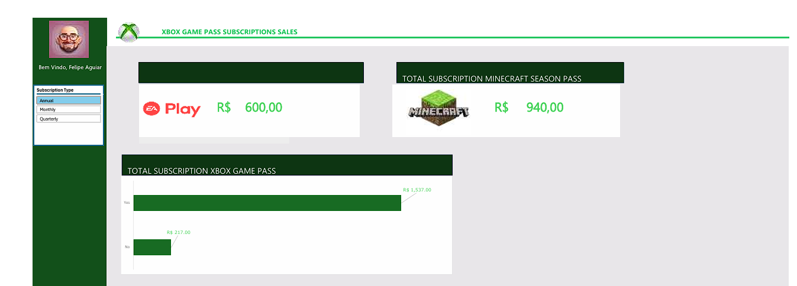

# Dashboard de Vendas do Xbox com Excel

## Objetivo do Projeto

O objetivo deste desafio é criar um dashboard de vendas, com foco na organização e visualização de dados. O objetivo é transformar dados brutos em informações visuais claras e úteis, permitindo uma análise eficaz do desempenho de vendas e a tomada de decisões baseadas em dados.

## Dados Utilizados

Os dados utilizados neste projeto incluem informações de vendas, como quantidade vendida, receita gerada, e outras métricas relevantes para análise de desempenho.

## Instruções para Reprodução

1. Abra o arquivo `dashboard_vendas_xbox.xlsx` no Excel.
2. Navegue até a aba `D̳ashboard`.
3. Visualize o dashboard com a nova identidade visual aplicada.

## Identidade Visual

A nova identidade visual do dashboard utiliza as seguintes cores:
- **Branco**: `#FFFFFF`
- **Verde Escuro**: `#0d3512`
- **Verde Claro**: `#47d359
- **Cinza**: `#E8E6E9`

Os cabeçalhos estão estilizados com verde escuro e fonte verde claro em negrito, enquanto as células de dados estão estilizadas com cinza e branco. O alinhamento é centralizado para melhor visualização.

